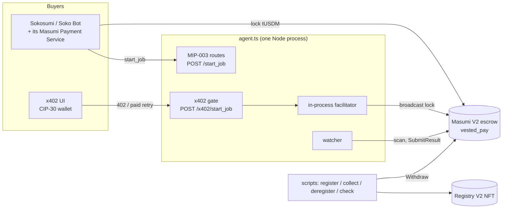
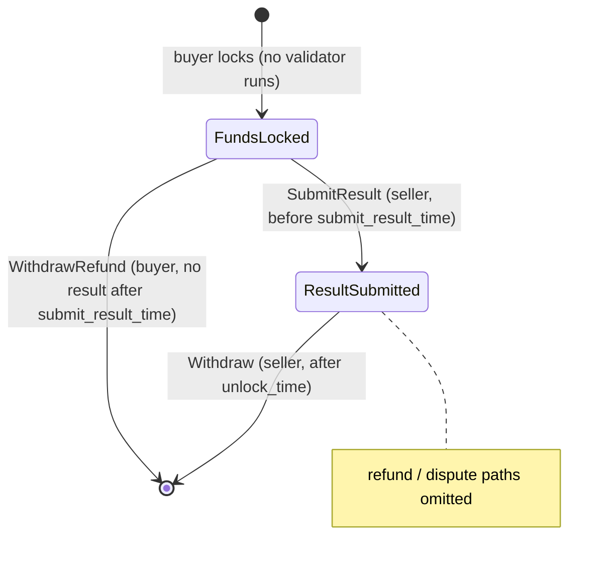

# Developer guide: building a Masumi agent

This guide is for developers who want to use this demo as a blueprint for their own Masumi agent. It explains how the pieces fit, what Masumi and Sokosumi expect on the wire and on chain, which invariants protect the seller's money, and what to change for a real agent. The [README](../README.md) covers running it.

Upstream sources are cited as `repo@commit path:lines`. The ports and tests were written against these revisions:

| Repository | Commit |
|---|---|
| `masumi-network/masumi-payment-service` | `69297f3` |
| `masumi-network/sokosumi` | `8327114` |
| `masumi-network/masumi-registry-service` | HEAD, 2026-09-30 |
| `@x402/cardano`, `@x402/core`, `@x402/express` | `2.26.0` |
| `@evolution-sdk/evolution` | `0.5.13` |

## 1. Architecture



| Module | Role | Runs in |
|---|---|---|
| `src/constants.ts` | Network constants, tUSDM units, unit normalization, key-hash helper | Node and browser |
| `src/masumi.ts` | Pure logic: registry asset name and metadata, MIP-004 hashes, standard-path signed terms, SubmitResult datum | Node |
| `src/registry.ts` | `MasumiRegistryValidator`: confirms an `agentIdentifier` claim on chain | Node and browser |
| `src/lockMatch.ts` | Decides whether an escrow UTxO pays for a job (funds invariant) | Node |
| `src/chain.ts` | Evolution SDK transactions: register, deregister, SubmitResult, Withdraw; the escrow scan | Node |
| `src/agent.ts` | HTTP API, x402 wiring, job store, watcher | Node |
| `src/config.ts` | `.env` parsing | Node |
| `src/scripts/*` | CLIs | Node |
| `src/ui/*` | React UI and the CIP-30 signer | Browser |
| `test/vendor/paymentServiceVerifier.ts` | Independent port of Sokosumi's and the Payment Service's purchase checks | Tests and `check-purchase` |

**Dependency direction.** `constants`, `masumi`, `lockMatch` and `registry` have no IO except `fetch` in `registry`. `chain` and `agent` do the IO. The UI imports only browser-safe modules. Keep it that way, because it keeps the security-relevant logic unit-testable.

## 2. Masumi concepts

### 2.1 Registry: an agent is an NFT

An agent is registered by minting one NFT under the **registry V2 policy** `67ab0c92c4ac1610895a1c965ee50aba41a8f1513b15240723b3bd0b`. The policy is the same on preprod and mainnet (`masumi-payment-service@69297f3 smart-contracts/registry-v2/validators/mint.ak`).

- **Permissionless.** There is no admin or signer check. Trust is enforced off chain by indexers and buyers.
- **Asset name** is `0x10 ++ blake2b_224(seedTxHash ++ u32be(seedIndex)) ++ 000000`. The seed UTxO must be spent in the same transaction, which makes the name globally unique. The first byte must be greater than `0x0f`, so the name can't collide with CIP-67/68 labels. The last 3 bytes are a version for `UpdateAction`.
- **Redeemers:** `MintAction = Constr 0 []`, `UpdateAction = Constr 1 []`, `BurnAction = Constr 2 []`.
- **`agentIdentifier`** is `policyId ++ assetName` (120 hex characters). It appears in escrow datums, in MIP-003 responses and in Sokosumi.

**Metadata.** The NFT carries CIP-25 label 721: `{ [policyId]: { [assetName]: metadata }, version: "1" }`. `registryMetadata()` builds a V2 entry exactly like the Payment Service's own builder (`packages/payment-source-v2/src/services/registry/register/service.ts:190-320`):

```jsonc
{
  "name": ["x402 Masumi demo agent"],          // strings chunked into ≤ 60-byte arrays
  "description": ["…"],
  "api_base_url": ["https://agent.example.com"],
  "author": { "name": ["…"] },
  "tags": ["demo", "x402"],                     // plain strings ≤ 64 bytes
  "image": ["ipfs://…"],
  "metadata_version": "2",
  "supported_payment_sources": [{
    "chain": ["Cardano"], "network": ["Preprod"],
    "settlement": { "paymentSourceType": ["Web3CardanoV2"], "address": ["addr_test1wzs4e6…"] },
    "pricing": { "pricingType": "Fixed", "fixed": [{ "asset": ["16a55b2a…", "…745553444d"], "amount": "1000000" }] }
  }]
}
```

Three parsers read this metadata, and it must satisfy all of them:

- **The registry service** is `.strict()`, requires `metadata_version` 2 and treats a missing `type` as a Standard agent (`masumi-registry-service src/services/cardano-registry/web3-cardano-v2-metadata.ts`).
- **The Payment Service** requires `api_base_url`, `name` and `author.name` (`src/routes/api/registry/wallet/index.ts:22-107`).
- **Sokosumi** projects the pricing, and every unit needs a credit row.

`test/masumi.test.ts` parses the output with ports of the first two.

**Discovery and health.** The registry service polls mints of the policy and indexes valid entries. It is **Online** only if `GET {api_base_url}/availability` returns HTTP 200 with `agentIdentifier` equal to the NFT, or `type: "masumi-agent"`. It rejects private or loopback URLs and redirects (`src/services/health-check/health-check.service.ts`).

### 2.2 Escrow: `vested_pay` V2

The escrow is `vested_pay` (`smart-contracts/payment-v2/validators/vested_pay.ak`), a Plutus V3 spend validator parameterized by `(required_admins, admin_vks, cooldown_period)`.

- **Preprod parameters:** 2-of-3 admins, cooldown 420 000 ms. They give the address `addr_test1wzs4e6wc95hkwezlccjw9mdvq0r0rsgx6zk34avptga3ftgn37w4g` (script hash `a15ce9d8…14ad`). `@x402/cardano` derives the same address, and `test/masumi.test.ts` checks it.
- **Nothing is validated at lock time.** Anyone can create any UTxO at the escrow address with any datum. Everything below that talks about "matching" exists because of that.

**The datum** is `Constr 0`, 19 fields. "Who decides" means who chooses the value when the lock is created:

| # | Field | Type | Who decides |
|---|---|---|---|
| 0 | `buyer` | Address (vkey payment credential) | buyer |
| 1 | `buyer_return_address` | Option Address | buyer |
| 2 | `seller` | Address | seller (signed terms) |
| 3 | `seller_return_address` | Option Address | seller. This demo requires `None` |
| 4 | `reference_key` | bytes (COSE_Key) | seller |
| 5 | `reference_signature` | bytes (COSE_Sign1, ≥ 16 bytes, unique per UTxO) | seller |
| 6 | `seller_nonce` | bytes (32) | seller |
| 7 | `buyer_nonce` | bytes | buyer's identifier, echoed in the signed terms |
| 8 | `agent_identifier` | bytes | seller |
| 9 | `collateral_return_lovelace` | int | buyer (min-UTxO pre-fund returned to the buyer) |
| 10 | `input_hash` | bytes | seller (signed) |
| 11 | `result_hash` | bytes | empty at lock; SubmitResult sets it |
| 12–15 | `pay_by_time`, `submit_result_time`, `unlock_time`, `external_dispute_unlock_time` | POSIX ms | seller (signed) |
| 16 | `seller_cooldown_time` | POSIX ms | 0 at lock; SubmitResult sets it |
| 17 | `buyer_cooldown_time` | POSIX ms | 0 at lock |
| 18 | `state` | constructor | `FundsLocked(0)` at lock |

**States:** `FundsLocked 0`, `ResultSubmitted 1`, `RefundRequested 2`, `Disputed 3`, `WithdrawAuthorized 4`, `RefundAuthorized 5`.

**Redeemers:** `Withdraw 0`, `SetRefundRequested 1`, `AuthorizeWithdrawal 2`, `WithdrawRefund 3`, `WithdrawDisputed 4 {…}`, `SubmitResult 5`, `AuthorizeRefund 6`.

This demo implements the happy path. The Masumi Payment Service implements the rest.



### 2.3 The seller transactions

The rules below were verified against the real validators with `aiken tx simulate`: every positive transaction was accepted, and each of 9 faulty variants per lock shape was rejected. The implementation is `src/chain.ts`.

**SubmitResult** (redeemer `Constr 5 []`)
- Spend the lock and create **exactly one** continuing output:
  - at the input's own address;
  - with **identical native assets**; lovelace may only grow, and `autoMinUtxo` tops it up because the datum grows;
  - with an inline datum equal to the input except field 11 (non-empty result hash), 16 (seller cooldown) and 18 (`Constr 1 []`). Field 17 must stay 0.
- **Validity:**
  - The lower bound is finite and ≥ the input's `seller_cooldown_time`.
  - The upper bound is finite, and the validator sees the **start of the upper-bound slot**, which must be `< submit_result_time`.
  - `seller_cooldown_time` must be ≥ `slotStart(upper) + cooldown_period`.
- The seller's key is a required signer, plus collateral.

**Withdraw** (redeemer `Constr 0 []`)
- Requires state `ResultSubmitted`, a non-empty `result_hash` and `seller_return_address = None`.
- **Validity:** the lower bound is rounded **up** to a slot ≥ `unlock_time`, and there must be some finite upper bound.
- **No output** may go back to the escrow.
- If `collateral_return_lovelace > 0`, one output pays at least that much to `buyer_return_address ?? buyer`. It must match the full address, stake part included, and carry the inline datum `OutputReference = Constr 0 [txHashBytes, index]`.
- Everything else goes to the seller as change.
- Use **one escrow input per transaction**: two inputs that share a `reference_signature` fail.

### 2.4 Timing

| Rule | Source |
|---|---|
| `payBy + 5 min ≤ submitResult`, `submitResult ≥ now + 15 min`, `submitResult + 15 min ≤ unlock`, `unlock + 15 min ≤ externalDisputeUnlock` | Payment Service `purchases/shared.ts:53-68` (checked at `/purchase`) |
| The buyer node auto-refunds if `result_hash` is still empty 10 min after `submit_result_time` | `packages/payment-source-v2/src/services/payments/automatic-decisions/service.ts:110-130` |
| `STANDARD_DEADLINES`: payBy +15, submitResult +40, unlock +60, dispute +80 min after `start_job` | `src/masumi.ts` |
| x402 path: library defaults (`payByTime = now + maxTimeoutSeconds`, submit +15 min, unlock +35 min after payBy) | `@x402/cardano` `DEFAULT_MASUMI_DEADLINE_OFFSETS` |

## 3. The standard path (MIP-003, Sokosumi)

**The flow.**
1. Sokosumi calls `GET /input_schema`.
2. It calls `POST /start_job {identifier_from_purchaser (20 hex), input_data}`.
3. It parses our response (`sokosumi packages/masumi/src/schemas/agent/start_job.schema.ts`).
4. It forwards the response to its Payment Service `POST /purchase` (`packages/masumi/src/clients/masumi-payment.client.ts:555-587`).
5. It polls `GET /status?job_id=` until it sees `completed` with a non-empty `result`.

It never calls `/availability`; the registry does.

**The purchase check.** `/purchase` (`purchases/shared.ts:37-280`) accepts our terms only if all of these hold:

1. The **current holder of the registry NFT** has the payment key hash `sellerVKey`, and the COSE key in our signature hashes to the same value.
2. The on-chain metadata source (index `supportedPaymentSourceIndex`) is `Cardano / Preprod / Web3CardanoV2`, and its address is the escrow address inside the identifier. Its Fixed price equals the amounts Sokosumi bills.
3. The `blockchainIdentifier` decodes to `sellerNonce‖agentIdentifier . identifierFromPurchaser . signature . key . escrowAddress`. It is LZString `compressToUint8Array`, then hex.
4. The **signature** verifies over `sha256(canonical-json(payload))`, where the payload is rebuilt by the buyer:

```js
{
  inputHash,                        // our input_hash, verbatim
  agentIdentifier,
  purchaserIdentifier,              // identifier_from_purchaser
  sellerIdentifier,                 // sellerNonce(64 hex) + agentIdentifier
  RequestedFunds: null,             // Fixed pricing
  payByTime, submitResultTime, unlockTime, externalDisputeUnlockTime,   // ms as strings
  sellerAddress,                    // the NFT holder's bech32, exactly (stake part included)
  sellerReturnAddress: null,        // the buyer's node has no hot wallet for us
  smartContractAddress,             // escrow address
  supportedPaymentSourceIndex: 0,   // number; Sokosumi always forwards the resolved index
}
```

`canonical-json@0.2.0` sorts keys. CIP-8 `signData` signs the 32 digest bytes. Any drift changes the hash, so a single wrong field breaks every Sokosumi hire. These drifts are all caught by `test/standard-path.test.ts`:

- an omitted index;
- a non-null `sellerReturnAddress`;
- numeric times;
- a holder address without its stake part.

`standardTerms()` in `src/masumi.ts` produces this with the **same key** `@x402/cardano` uses (`toMasumiSellerSigner`). There is no Masumi Payment Service on the seller side.

**The lock** is then created by the buyer's node with our identifier's parts. `seller_nonce` is `sellerId[0:64]`, `buyer_nonce` is the purchaser id, and `reference_key`/`reference_signature` are ours (`packages/payment-source-v2/src/datum-builder.ts:37-49`). `collateral_return_lovelace` is typically most of the lock's lovelace, so at Withdraw the seller receives only the tUSDM.

## 4. The x402 path

`@x402/cardano` implements Masumi escrow as the `masumi` asset-transfer method of the `exact` scheme.

**Issuer.** `new ExactCardanoScheme({ masumi: { seller, agentIdentifier, commitment } })`.
- The route template is `{ payTo: escrow, extra: { assetTransferMethod: "masumi" } }`.
- The scheme issues a fresh, seller-signed quote for every 402 and stores it by `termsDigest`.
- `commitment` decides what the escrow's `input_hash` commits to. Here it is the job body, `{ identifier_from_purchaser, input_data }`, as one JCS part.

**The registry claim.** A quote with a non-empty `agentIdentifier` is rejected by `verifyMasumiAuthorization` unless the verifier is given a `validateRegistryClaim` and the `resource` (`chunk-MVYC4VJB.mjs:480-492`). Both sides pass `makeRegistryValidator(blockfrost)` from `src/registry.ts`: the buyer's CIP-30 signer and the in-process facilitator. The route's `resource` is `${AGENT_PUBLIC_URL}/x402/start_job`, so the URL check against `api_base_url` passes behind a tunnel or proxy.

**Settle ordering.** `@x402/express` runs the route handler **before** settlement (`@x402/express dist/esm/index.mjs:261` vs `:326`). The handler therefore does no chain work. It records the job under the lock's tx hash, and the watcher drives execution once the lock is on chain. That also covers a settlement that times out but lands later. The UI polls `GET /jobs/by-tx/:hash` for the same reason.

**Where the job input comes from.** The job input is read from `accepted.extra.inputCommitment.parts[0].content`, the content the buyer paid for, not from `req.body`. On a paid retry the library serves the stored quote and doesn't re-run the commitment hook.

**The facilitator** runs in-process: `x402Facilitator` plus `ExactCardanoScheme(toFacilitatorCardanoSigner(blockfrost), { validateRegistryClaim })`, adapted to `FacilitatorClient`. It holds no keys. To use a hosted facilitator instead, replace `facilitatorClient` with `new HTTPFacilitatorClient({ url })`.

**The unlisted tADA offer.** `POST /x402/start_job/ada` (price `X402_ADA_PRICE_LOVELACE`, default 5 tADA) is a second issuer **without** `agentIdentifier`. The library takes the registry claim from the issuer config, not per offer (`chunk-W6LS2M6Y.mjs:429`), and the registry advertises only the tUSDM price. So a tADA quote claiming the registry identity would fail every registry check.
- The escrow datum carries an empty `agent_identifier`.
- `verifyMasumiAuthorization` skips the registry step when the identifier is empty (`chunk-MVYC4VJB.mjs:471-508`).
- The buyer still verifies the seller's signature over the terms and the job commitment.
- Each offer has its own terms storage, so a quote from one route is rejected on the other.
- Lovelace is not a default x402 asset: the client must allow it explicitly in `spendControls`, capped at the price, or it rejects the offer (or pays uncapped).
- Sokosumi and the standard path are unaffected.

**Hiring via Sokosumi from the UI** (`src/sokosumi.ts`, the proxy at the end of `agent.ts`). With `SOKOSUMI_API_KEY` set, the UI can create a Sokosumi job for the agent. The calls are `GET /v1/agents?kind=cardano` (paged by `meta.pagination.nextCursor`) or `SOKOSUMI_AGENT_ID`, then `GET /v1/agents/{id}/input-schema`, `POST /v1/agents/{id}/jobs` and `GET /v1/jobs/{id}`. All use the user API key as a Bearer token, and responses come wrapped as `{ data, meta }`.
- **Where it runs.** The key is used only by a proxy bound to `127.0.0.1` on its own port. The tunnel forwards only the agent port.
- **Browser defences.** The proxy checks `Origin` and requires JSON. For direct hits it also checks `Host`. For requests through Vite (`xfwd`) it checks `X-Forwarded-Host` (the UI's host) and `X-Forwarded-For` (loopback), with Vite's own host check in front. So pages open in the operator's browser can't spend credits through DNS rebinding or cross-site posts, and neither can LAN clients if Vite runs with `--host`.
- **No retries.** The create call is never retried, because a retry would be a second paid job.
- **Status mapping.** Every Sokosumi job status maps to a UI stage (`sokosumiStage`), and anything unexpected ends polling.
- **Visibility.** Sokosumi's hire path uses the same visibility filter as its catalog, so a hidden agent returns 404 here too.

**Why x402 has its own route.** x402 quotes can't double as MIP-003 responses: the library signs a domain-separated `termsDigest`, not the Payment Service payload. So the two paths issue separate signatures and nonces. They share the seller key, the escrow, the datum shape and the watcher.

## 5. Security invariants

| Invariant | Where | Test |
|---|---|---|
| A lock is accepted only if **every seller-decided datum field** equals the signed terms. Only `buyer`, `buyer_return_address` and `collateral_return_lovelace` are free, and the latter must be ≤ the UTxO's lovelace. The paid token must be Masumi tUSDM and at least the price. x402 locks must also be the verified tx. This blocks public-nonce spoofs such as a year-2100 cooldown that blocks SubmitResult, a far-future `unlock_time`, or a broken collateral field. | `lockMatch.ts` | `lockMatch.test.ts` (one spoof per field, underpayment, wrong token, a spoof shadowing a genuine lock) |
| Units compare as `policy ++ name`, whether dotted, concatenated or `lovelace`. The library's own `USDM_PREPROD_ASSET` (`e675b46e…`) is a **different token** and is refused. | `constants.ts` | `masumi.test.ts`, `registry.test.ts` |
| The registry NFT, the signing key and the datum `seller` are the same credential, and the NFT sits at the **exact** signer address. | `chain.register`, `check-registry` | `standard-path.test.ts` (holder without stake part is rejected) |
| Escrow transactions are evaluated during `build()`, so nothing is signed if a script would fail and no collateral is forfeited. | `chain.ts` | — (Blockfrost evaluation; verified with aiken simulate) |
| Seller transactions run one at a time; the registry NFT and reference-script UTxOs are never selected as inputs or collateral. | `chain.ts` (`serial`, `spendable`) | — |
| Validity windows come from **chain time** (latest block), not the local clock. | `chain.tipMs` | — |
| x402 locks are looked up **by the verified transaction**: `/txs/{hash}/utxos` keeps only unspent, non-collateral escrow outputs (Evolution's `getUtxosByOutRef` alone does not filter spent ones), and an unknown transaction yields nothing instead of an error. Each job is processed in its own try/catch, so one bad job never stalls the others. | `chain.locksOfTx`, `agent.watch` | `chain.test.ts` |
| `collect` only spends escrow UTxOs of this seller in state 1 with a result, paying tUSDM or at least 1 tADA beyond the buyer's collateral return, because anyone can create fake ones. | `chain.collectAll` | — |

## 6. Adapting it

- **Your own task.** Replace `runTask` and `INPUT_SCHEMA` in `src/agent.ts`, and update `parseJobInput` to match. The result string goes to `resultHash()`, which is MIP-004 `sha256(identifier + ";" + output)`. If the work takes minutes, run it asynchronously in the watcher. Submit the result well before `submitResultTime` (40 min on the standard path), or the buyer can refund.
- **Input fields.** Anything JSON works. `inputHash` uses JCS (RFC 8785). Keep `input_data` a flat record, because that's what Sokosumi sends.
- **Price.** Set `PRICE_TUSDM_UNITS` and **register again**, since the price is part of the NFT metadata and every buyer checks it. The Payment Service can also *update* an entry (`UpdateAction`, which burns version n and mints n+1); this demo doesn't implement that.
- **Token.** Sokosumi lists only units it has credit rows for (tUSDM on preprod, USDM/USDCx on mainnet, per Masumi's docs). A lovelace price works for x402 but hides the agent on Sokosumi. Two differently priced sources make Sokosumi hide the agent too.
- **Dynamic pricing.** This needs `RequestedFunds` in the signed payload and `pricingType: "Dynamic"` in the metadata. The standard-path test shows exactly how the payload is rebuilt, so extend both sides together.
- **Persistence.** Jobs live in memory. Store `Job` in a database keyed by id and by lock tx. To finish a job after a restart you need its `expected` lock terms and its `input`.
- **Mainnet.**
  - Change `NETWORK`, the Blockfrost URL and the escrow deployment. Mainnet admin keys differ; check `@x402/cardano` `MASUMI_DEFAULT_DEPLOYMENT` and the Payment Service config.
  - Change the stablecoin unit.
  - Sokosumi mainnet listing requires whitelisting (`masumi-docs … list-agent-on-sokosumi.mdx`).
  - Replace the `.env` mnemonic with a proper key store.
- **Refunds and disputes.** These are admin/buyer paths (redeemers 1–4, 6). Your agent should at least submit on time; the Masumi Payment Service implements the full lifecycle.

## 7. Testing

```sh
npm run typecheck && npm test && npm run build
```

| File | Guards |
|---|---|
| `test/masumi.test.ts` | That the vendored blueprints are the ones the library knows (`sha256(JCS(blueprint)) == MASUMI_BLUEPRINT_DIGEST`); escrow script hash and registry policy id parity; the asset-name rule; metadata that parses under the registry-service and Payment Service schemas with ≤ 64-byte strings; MIP-004 hashes; the SubmitResult datum transition for both lock producers |
| `test/standard-path.test.ts` | Our HTTP `start_job` body through Sokosumi's schema and forwarding and the Payment Service's `/purchase` checks, using Mesh `checkSignature` from `@meshsdk/core-cst@1.9.0-beta.90`, the version the Payment Service pins. Drifted payloads must fail |
| `test/registry.test.ts` | The registry-claim validator: accept, and reject on wrong price, token, network, URL, holder, escrow or a Blockfrost failure |
| `test/lockMatch.test.ts` | Lock matching: a genuine lock passes, every spoof fails, and tADA and tUSDM payments are not interchangeable |
| `test/sokosumi.test.ts` | Sokosumi client: Bearer auth, envelope, cursor paging, unique name match, create body, the 404 hint, and the status-to-stage mapping for all 12 statuses |
| `test/chain.test.ts` | x402 lock lookup by transaction: only unspent, non-collateral escrow outputs; an unknown transaction yields nothing |

`test/vendor/paymentServiceVerifier.ts` shares **no code** with `src/`. After Masumi or Sokosumi change their purchase flow, update the port from the cited files and rerun the tests. Against a running agent, `npm run check-quote` and `npm run check-purchase` run the same checks on live HTTP responses, and `npm run check-registry` validates the on-chain entry.

The chain transactions have no unit tests, because they need a node and evaluator. They were verified with `aiken tx simulate` against the vendored validators using real preprod protocol parameters, and in production every transaction is evaluated before signing.

## 8. Pitfalls

1. **Two tUSDM tokens on preprod.** Masumi and Sokosumi use `16a55b2a…0014df10745553444d`. `@x402/cardano`'s `USDM_PREPROD_ASSET` is `e675b46e…`. Always set the unit explicitly.
2. **Metadata unit form.** Metadata and Blockfrost use `policy ++ name`, and x402 `asset` uses `policy.name`. Normalize before comparing.
3. **`api_base_url` is immutable** without an update transaction. Quick-tunnel URLs change, which makes the agent Offline and drops it from Sokosumi.
4. **Seller address must match exactly.** The Payment Service compares the NFT holder's bech32 as a string inside the signed payload. Don't move the NFT to another address of the same key.
5. **The cooldown uses slot starts.** The validator sees `slotStart(upper)`, and `seller_cooldown_time` must be ≥ that + 420 000 ms.
6. **The Withdraw lower bound rounds up.** One slot early is rejected.
7. **Min-UTxO grows at SubmitResult.** The result hash and a non-zero cooldown add bytes. Let the builder top up lovelace; never change native assets.
8. **Collateral.** Evolution reserves 5 ADA of collateral by default. Keep a pure-ADA UTxO of at least that in the seller wallet.
9. **The handler runs before settlement** in `@x402/express`. Never do chain work in an x402 route handler.
10. **Mesh ESM + libsodium.** `@meshsdk/core-cst`'s ESM entry fails to load `libsodium-wrappers-sumo` under Node. The tests load its CommonJS build via `createRequire`.
11. **Sokosumi has no Hire button** (ADR-0006/0024). Hires come from Soko Bot, Coworker or `POST /v1/agents/{id}/jobs`.
12. **Sokosumi visibility is a server setting.** Its agent sync (about every 5 min) stores new agents with `isShown = SHOW_AGENTS_BY_DEFAULT`, which defaults to `false` in code (`sokosumi apps/core/src/config/env.ts:274`, `services/agent-sync.service.ts:355`). A correctly registered, Online agent can therefore stay hidden until the Sokosumi operators show it. Masumi's docs say preprod agents appear automatically; verify your registry entry is Online first, then ask them.
