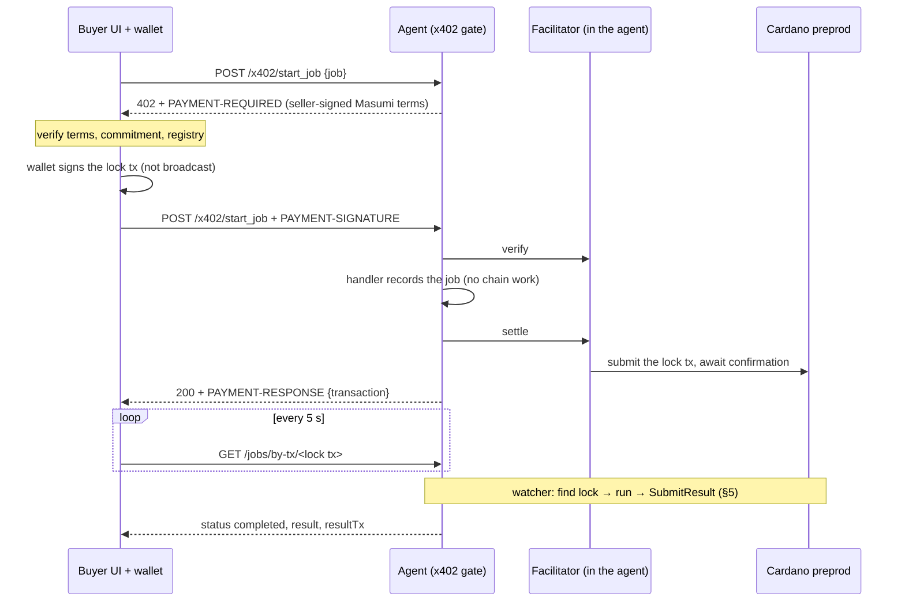
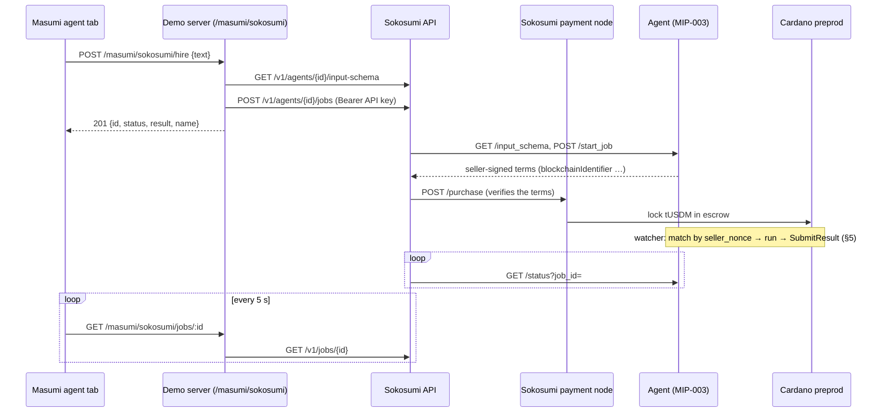
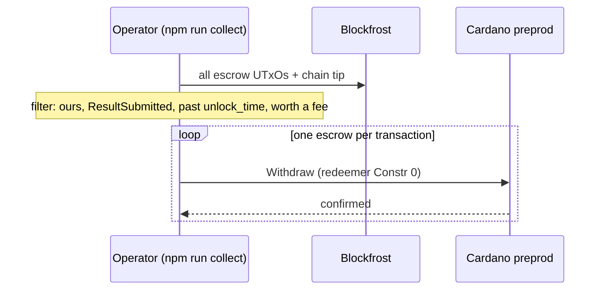

# Flows: every request and every transaction

This is the protocol reference for the demo. For each flow it shows who talks to whom, what the HTTP requests and responses look like, what each party checks, and how each Cardano transaction is built.

- Read [DEVELOPER.md](DEVELOPER.md) first for the concepts, the glossary and the two hire paths side by side.
- To follow a run, read §3 (x402) or §4 (Sokosumi). §5–§8 are the seller side and the on-chain details; §1, §2 and §7 work as reference.
- Read the [README](../README.md) to run the demo.

**How to read the examples.**
- Every example names its **source**: the function or file that produces or consumes it.
- Values in `<angle brackets>` are placeholders.
- Examples marked *simulated* come from the UI's replay (`frontend/src/masumi/example.ts` in the main demo). They are not real chain data.
- Paths starting `src/` are in this folder (`masumi/`); `frontend/` and `server/` are the main demo next to it.
- Times are POSIX milliseconds, as in the datum.

Two tests check the facts most likely to drift against the code: `test/docs.test.ts` here (redeemer indices, the agent's routes, deadlines, header names) and the main demo's `tests/masumi-tab-docs.test.ts` (datum field order, UI step ids, `/masumi` routes).

**From the screen to this document.** The Masumi agent tab numbers its steps; this document uses their ids.

| x402 step on screen | Id | Section |
|---|---|---|
| 01 Ask for the job, get a 402 offer | `request` | §3.1 |
| 02 Verify the offer | `verify` | §3.2 |
| 03 Sign the escrow lock | `sign` | §3.3 |
| 04 Send the payment over HTTP | `pay` | §3.4 |
| 05 The facilitator verifies and broadcasts | `settle` | §3.5 |
| 06 The agent finds the lock on chain | `lock` | §3.6, §5 |
| 07 The agent submits the result hash | `result` | §3.6, §5 |
| 08 Seller collects after the unlock time | `collect` | §3.7, §6 |

| Sokosumi step on screen | Id | Section |
|---|---|---|
| 01 Create a job on Sokosumi | `hire` | §4.1 |
| 02 Sokosumi calls the agent's start_job | `startJob` | §4.2 |
| 03 Sokosumi's payment node locks tUSDM in escrow | `pay` | §4.3 |
| 04 The agent works and submits the result hash | `work` | §4.4, §5 |
| 05 Sokosumi delivers the result | `done` | §4.4 |
| 06 Seller collects after the unlock time | `collect` | §4.5, §6 |

## Contents

1. [Parties and routes](#1-parties-and-routes)
2. [Registration](#2-registration)
3. [x402 purchase](#3-x402-purchase)
4. [Sokosumi purchase (standard MIP-003 path)](#4-sokosumi-purchase-standard-mip-003-path)
5. [The agent's watcher and SubmitResult](#5-the-agents-watcher-and-submitresult)
6. [Collect (Withdraw)](#6-collect-withdraw)
7. [Transaction anatomy](#7-transaction-anatomy)
8. [Deadlines](#8-deadlines)

---

## 1. Parties and routes

| Party | Runs where | Holds keys? | Code |
|---|---|---|---|
| Buyer (x402) | the main demo's Masumi agent tab, with a CIP-30 wallet | the buyer's wallet | `frontend/src/masumi/x402Flow.ts`, `frontend/src/masumi/cip30Signer.ts` |
| Demo server | the main demo's `server/` (port 4021, `127.0.0.1` only) | none for x402; the operator's `SOKOSUMI_API_KEY` | `server/src/masumi.ts` |
| Agent (seller) | `npm run agent` | the seller mnemonic | `src/agent.ts`, `src/chain.ts` |
| Facilitator | inside the agent process | none (it only broadcasts signed transactions) | `src/agent.ts` (`facilitatorClient`) |
| Sokosumi | Sokosumi's servers and payment node | its own wallet | external; client in `src/sokosumi.ts` |
| Escrow | the `vested_pay` V2 script on preprod | none; rules only | `contracts/payment-v2.plutus.json` |
| Registry | the registry V2 mint policy on preprod | none; rules only | `contracts/registry-v2.plutus.json` |

**The agent's HTTP routes** (`src/agent.ts`). The Masumi agent tab never calls the agent directly. It calls the demo server under `/masumi`, which forwards a fixed set of these routes unchanged: `/availability`, `/demo/config` (as `/masumi/config`), `/x402/start_job[/ada]` and `/jobs/by-tx/:hash`. The examples below show the agent-side paths.

| Route | Kind | Purpose |
|---|---|---|
| `GET /availability` | MIP-003 | Health check; the registry calls it |
| `GET /input_schema` | MIP-003 | The input form Sokosumi renders |
| `POST /start_job` | MIP-003 | Standard path: returns seller-signed terms; nothing is paid here |
| `GET /status?job_id=<id>` | MIP-003 | Job status, plus the result once completed |
| `POST /x402/start_job` | x402 | Registered offer, priced in tUSDM (`PRICE_TUSDM_UNITS`) |
| `POST /x402/start_job/ada` | x402 | Unlisted offer, priced in lovelace (`X402_ADA_PRICE_LOVELACE`) |
| `GET /jobs/:id` | demo | The full job view |
| `GET /jobs/by-tx/:hash` | demo | The same view, looked up by the lock transaction hash |
| `GET /demo/config` | demo | The offers and addresses; the demo server adds whether Sokosumi hiring is enabled |

**The demo server's `/masumi` routes** (`server/src/masumi.ts`). The Masumi agent tab calls them at `VITE_SERVER_URL`.

| Route | What it does |
|---|---|
| `GET /masumi/availability` | Forwards `GET /availability` to the agent (the tab's "is the agent running?" check) |
| `GET /masumi/config` | Forwards `GET /demo/config`, then sets `sokosumi.enabled` from the server's own settings |
| `POST /masumi/x402/start_job` | Forwards the job body and `PAYMENT-SIGNATURE`; returns the agent's status, body, `PAYMENT-REQUIRED` and `PAYMENT-RESPONSE` |
| `POST /masumi/x402/start_job/ada` | The same for the tADA offer |
| `GET /masumi/jobs/by-tx/:hash` | Forwards the job lookup, for a 64-hex hash only |
| `POST /masumi/sokosumi/hire` | Sokosumi proxy: `GET /v1/agents/{id}/input-schema`, then `POST /v1/agents/{id}/jobs` (§4.1) |
| `GET /masumi/sokosumi/jobs/:id` | Sokosumi proxy: `GET /v1/jobs/{id}` |

The two Sokosumi routes exist only when the server has `SOKOSUMI_API_KEY`, and they answer only the demo frontend's origin (§4.1).

---

## 2. Registration

An agent is registered by minting one NFT under the registry V2 policy, carrying label-721 metadata. The command is `npm run register` (`src/scripts/register.ts` → `chain.register`).

```mermaid
sequenceDiagram
  participant Op as Operator (npm run register)
  participant Agent as Agent (npm run agent)
  participant Chain as Cardano preprod
  participant Reg as Masumi registry service
  participant Soko as Sokosumi
  Op->>Chain: mint registry NFT (MintAction) + 721 metadata
  Chain-->>Op: tx confirmed; agentIdentifier = policy ++ assetName
  Reg->>Chain: indexes the new NFT
  Reg->>Agent: GET /availability (via AGENT_PUBLIC_URL)
  Note over Reg: agent Online
  Soko->>Reg: agent sync (about every 5 min)
  Note over Soko: listed if Sokosumi shows new agents
```

**The metadata** (`registryMetadata` in `src/masumi.ts`). Cardano metadata strings are at most 64 bytes, so long strings are split into chunks of at most 60 bytes (`toMetadataChunks`).

```json
{
  "<registry policy id>": {
    "<asset name>": {
      "name": ["x402 Masumi demo agent"],
      "description": ["Demo agent: reverses and upper-cases your text. Pays via Mas", "umi escrow or x402."],
      "api_base_url": ["https://<your tunnel>"],
      "author": { "name": ["x402 Cardano demo"] },
      "tags": ["demo", "text", "x402"],
      "image": ["ipfs://QmXXW7tmBgpQpXoJMAMEXXFe9dyQcrLFKGuzxnHDnbKC7f"],
      "metadata_version": "2",
      "supported_payment_sources": [{
        "chain": ["Cardano"],
        "network": ["Preprod"],
        "settlement": { "paymentSourceType": ["Web3CardanoV2"], "address": ["addr_test1wzs4e6wc95hkwezlccjw9mdvq0r0rsgx6zk34avptga3ftgn37w4g"] },
        "pricing": { "pricingType": "Fixed", "fixed": [{ "asset": ["16a55b2a…0014df10745553444d"], "amount": "1000000" }] }
      }]
    }
  },
  "version": "1"
}
```

The asset in `fixed` is the full 56+18-hex Masumi tUSDM unit (`TUSDM_UNIT`), shortened here. The chunks shown are illustrative; the real split is by bytes.

**Who reads it and what they require:**
- The x402 registry check (`makeRegistryValidator` in `src/registry.ts`) requires:
  - exactly one source;
  - Cardano / Preprod / `Web3CardanoV2` on the escrow address;
  - a Fixed price equal to the signed amount and asset;
  - the paid URL under `api_base_url`;
  - the NFT held by the seller's payment key.
- The Payment Service `/purchase` check, which Sokosumi runs, requires the same holder and source (see [DEVELOPER.md §3](DEVELOPER.md#3-the-standard-path-mip-003-sokosumi)).

`npm run deregister` burns the NFT (`BurnAction`). The anatomy of both transactions is in [§7](#7-transaction-anatomy).

---

## 3. x402 purchase

The buyer is the main demo's Masumi agent tab. The client code is `runX402` (`frontend/src/masumi/x402Flow.ts`); the signer is `createCip30Signer` (`frontend/src/masumi/cip30Signer.ts`). Each request below goes through the demo server's `/masumi` forward (§1), which the diagram leaves out. The UI steps, by id: `request`, `verify`, `sign`, `pay`, `settle`, `lock`, `result`, `collect`.



### 3.1 `request`: the unpaid request returns a 402 offer

The source is `runX402` step 1. The body is a MIP-003 job body. `identifier_from_purchaser` is 20 random hex characters (`randomHex(10)`).

```http
POST /x402/start_job HTTP/1.1
Content-Type: application/json

{"identifier_from_purchaser":"a1a1a1a1a1a1a1a1a1a1","input_data":{"text":"hello masumi"}}
```

The agent validates the body (`parseJobInput`) and caps open jobs at 500. The `@x402/express` gate then answers, since there is no `PAYMENT-SIGNATURE`:

```http
HTTP/1.1 402 Payment Required
Content-Type: application/json
PAYMENT-REQUIRED: <base64 of the JSON below>

{}
```

**`PAYMENT-REQUIRED`, decoded.** This example is *simulated*: its shape comes from `exampleDeps`, and its values are fakes. A real one is issued by `x402Offer` in `src/agent.ts` through `ExactCardanoScheme` with `masumi` options.

```json
{
  "x402Version": 2,
  "resource": { "url": "https://<AGENT_PUBLIC_URL>/x402/start_job", "description": "Masumi agent job paid into escrow" },
  "accepts": [{
    "scheme": "exact",
    "network": "cardano:preprod",
    "payTo": "addr_test1wzs4e6wc95hkwezlccjw9mdvq0r0rsgx6zk34avptga3ftgn37w4g",
    "asset": "16a55b2a349361ff88c03788f93e1e966e5d689605d044fef722ddde.0014df10745553444d",
    "amount": "1000000",
    "maxTimeoutSeconds": 300,
    "extra": {
      "assetTransferMethod": "masumi",
      "areFeesSponsored": false,
      "terms": {
        "version": "1", "paymentType": "Web3CardanoV2",
        "sellerAddress": "<seller bech32>", "sellerNonce": "<64 hex>", "buyerNonce": "",
        "agentIdentifier": "<120 hex: registry policy ++ asset name>",
        "inputHash": "<64 hex>",
        "payByTime": "<ms>", "submitResultTime": "<ms>", "unlockTime": "<ms>", "externalDisputeUnlockTime": "<ms>"
      },
      "inputCommitment": {
        "version": "1", "algorithm": "sha256",
        "parts": [{ "name": "body", "canonicalization": "jcs", "mediaType": "application/json",
                    "content": { "identifier_from_purchaser": "a1a1a1a1a1a1a1a1a1a1", "input_data": { "text": "hello masumi" } },
                    "digest": "<sha256 of the part>" }],
        "digest": "<equals terms.inputHash>"
      },
      "referenceKey": "<COSE key hex>",
      "referenceSignature": "<COSE_Sign1 hex>",
      "blockchainIdentifier": "<hex>"
    }
  }]
}
```

What to notice:
- `payTo` is the **escrow**, not the seller.
- The asset uses x402's dotted form, `policy.assetName`. The unlisted route uses `"lovelace"`, a price of `X402_ADA_PRICE_LOVELACE`, and an empty `agentIdentifier`.
- `inputCommitment` holds the whole job body. On this path `input_hash` is the library's commitment digest: a domain-separated hash (`masumi:x402:input:v1`) over the parts' digests (`computeInputHash` in `@x402/cardano`). It is **not** the MIP-004 formula that the standard path uses.
- `referenceKey` and `referenceSignature` are the seller's CIP-8 signature over the terms digest. They go into the datum verbatim.

### 3.2 `verify`: the buyer checks the offer before signing

This runs in `createCip30Signer.buildAndSignPaymentTransaction`, which the x402 client calls after it has chosen the offer. Before that, the client filters offers: `spendControls` allows exactly this asset, capped at the price, and a policy keeps only `masumi` offers for the chosen asset and amount.

| Check | Where |
|---|---|
| `extra` is well-formed Masumi escrow terms for preprod | `validateMasumiExtra` |
| The seller's signature covers these terms; the terms match the requirement's amount, asset and payTo | `verifyMasumiAuthorization` |
| The registry NFT confirms the agent, price, URL and seller (registered offer only) | `validateRegistryClaim` → `makeRegistryValidator` |
| The commitment is exactly the job the buyer sent | `JSON.stringify(parts[0].content) === JSON.stringify(body)` |
| The buyer is not the seller; the wallet holds enough | `cip30Signer.ts` |

The UI shows `{ termsDigest, registry: "checked" | "skipped" }`.

### 3.3 `sign`: the wallet signs the lock

`buildMasumiLock` gives the 19-field datum and the lovelace to lock. The wallet signs a transaction that pays the escrow. Its anatomy is in [§7.1](#71-lock-buyer-x402-path). Nothing is broadcast. The transaction hash is known now and is used from here on.

### 3.4 `pay`: the paid request

The source is `runX402` step 3. The same request is repeated with the payment header:

```http
POST /x402/start_job HTTP/1.1
Content-Type: application/json
PAYMENT-SIGNATURE: <base64 of the JSON below>

{"identifier_from_purchaser":"a1a1a1a1a1a1a1a1a1a1","input_data":{"text":"hello masumi"}}
```

**`PAYMENT-SIGNATURE`, decoded** (an x402 v2 `PaymentPayload`):

```json
{
  "x402Version": 2,
  "resource": { "url": "https://<AGENT_PUBLIC_URL>/x402/start_job", "description": "…" },
  "accepted": { "scheme": "exact", "network": "cardano:preprod", "payTo": "<escrow>", "asset": "<asset>", "amount": "1000000", "maxTimeoutSeconds": 300, "extra": { "…": "the offer's extra, unchanged" } },
  "payload": {
    "transaction": "<base64 CBOR of the fully signed, unbroadcast lock tx>",
    "nonce": "<txHash>#<index> of a wallet input the transaction spends"
  }
}
```

The `nonce` must be one of the transaction's inputs. The facilitator uses it to reject replays, and the owner of that input is the buyer written into the datum.

### 3.5 `settle`: the facilitator verifies and broadcasts

The source is the `@x402/express` middleware in `src/agent.ts`, and the order matters:

1. **Verify.** Three parts:
   - **Quote lookup.** The agent's x402 server (`ExactCardanoScheme` with `masumi` options) finds the quote it issued, by terms digest, and uses it as the requirements. An unknown or altered quote is rejected.
   - **Transaction check.** The facilitator verifies the signed transaction against those requirements:
     - the nonce is an input and still unspent, and the datum's buyer is the nonce's owner;
     - the validity upper bound is ≤ `pay_by_time`;
     - the escrow output carries exactly the signed datum and value;
     - the registry claim holds.
   - **Binding.** The server binds that quote to this one transaction hash, so a quote cannot pay for two transactions.
2. **Handler.** `x402Job(req)` records the job under the lock's transaction hash. It does no chain work, because the payment is not settled yet. The job input is read from the paid commitment, not from `req.body`.
3. **Settle.** The facilitator submits the transaction and waits for confirmation.
4. **Response.** Only then is the response sent:

```http
HTTP/1.1 200 OK
Content-Type: application/json
PAYMENT-RESPONSE: <base64 of {"success":true,"transaction":"<lock tx hash>","network":"cardano:preprod","payer":"<buyer bech32>"}>

{"id":"<uuid>","job_id":"<uuid>","path":"x402","status":"awaiting_payment","blockchainIdentifier":"<hex>",
 "agentIdentifier":"<120 hex>","sellerVKey":"<56 hex>","identifierFromPurchaser":"a1a1a1a1a1a1a1a1a1a1","input_hash":"<64 hex>",
 "payByTime":<ms>,"submitResultTime":<ms>,"unlockTime":<ms>,"externalDisputeUnlockTime":<ms>,"lockTx":"<lock tx hash>"}
```

The body is `view(job)` (`src/jobView.ts`), and bigints are sent as strings. If this long request drops, nothing is lost: the UI already knows the transaction hash.

### 3.6 `lock` and `result`: following the job

```http
GET /jobs/by-tx/<lock tx hash> HTTP/1.1
```

The UI polls every 5 s. It answers `404 {"error":"Unknown transaction"}` until the paid request's handler has run, and then `200` with the job view. As the watcher advances ([§5](#5-the-agents-watcher-and-submitresult)), the status goes `awaiting_payment` → `running` (the `lock` field appears with the matched UTxO and datum) → `completed`:

```json
{ "id": "<uuid>", "status": "completed", "lockTx": "<hash>",
  "lock": { "ref": "<hash>#0", "lovelace": "1452160", "tokens": { "16a55b2a…745553444d": "1000000" }, "datum": { "…": "19 fields" } },
  "result": "IMUSAM OLLEH", "resultHash": "<sha256(identifier;result)>", "resultTx": "<SubmitResult tx hash>",
  "sellerCooldownTime": "<ms>", "unlockTime": <ms>, "…": "plus the terms fields from §3.5" }
```

The `lovelace` value `1452160` is *simulated* (from `exampleDeps`). `completed` means the node **accepted** SubmitResult; the confirmation follows.

The UI gives up in four cases:
- the job reports `failed`;
- the paid request was rejected (non-2xx) and the agent does not know the transaction;
- after 6 network failures in a row;
- if the agent never knew the transaction by `payByTime + 2 min`.

### 3.7 `collect`

The `collect` step is agent-driven: the seller withdraws after `unlock_time` ([§6](#6-collect-withdraw)). The buyer's part ends once the result is submitted, so the UI checks this step when the result arrives. It does not watch the withdrawal.

---

## 4. Sokosumi purchase (standard MIP-003 path)

Sokosumi hires the agent as any Masumi Payment Service buyer would. The Masumi agent tab can start that from the browser through the demo server's Sokosumi proxy (`runSokosumi`, `frontend/src/masumi/sokosumiFlow.ts`). The UI steps, by id: `hire`, `startJob`, `pay`, `work`, `done`, `collect`. The UI observes only `hire` and the Sokosumi job status; `startJob` and `pay` happen inside Sokosumi.



### 4.1 `hire`: Masumi agent tab → demo server → Sokosumi

```http
POST /masumi/sokosumi/hire HTTP/1.1
Host: localhost:4021
Origin: http://localhost:5173
Content-Type: application/json

{"text":"hello masumi"}
```

The proxy (`sokosumiRouter` in `server/src/masumi.ts`) spends the operator's credits, so it answers only the demo frontend. It runs before the server's open CORS, and checks in this order:
- `Host` must be `127.0.0.1:<port>` or `localhost:<port>`, and the client must be on loopback (`403` otherwise). This stops DNS rebinding.
- No `Forwarded`, `X-Forwarded-*`, `X-Real-IP` or `CF-Connecting-IP` header (`403`). A request relayed by a tunnel or proxy is refused.
- `Origin` must be exactly one of `FRONTEND_ORIGINS` (`403`). A missing Origin is refused too.
- `Sec-Fetch-Mode`, when present, must be `cors` (`403`).
- Only GET and POST (`405`). A POST body must be JSON (`415`), which forces a CORS preflight, so a plain HTML form cannot post here.
- `text` must be 1–500 characters (`400`), and only one hire may run at a time (`409`).

`tests/masumi-tab-server.test.ts` in the main demo covers each rule.

`createSokosumi().hire` (`src/sokosumi.ts`) then makes these calls, each with `Authorization: Bearer <SOKOSUMI_API_KEY>`:

```http
GET /v1/agents?kind=cardano&limit=50[&cursor=<nextCursor>]     (only without SOKOSUMI_AGENT_ID; exact SOKOSUMI_AGENT_NAME match)
GET /v1/agents/<agentId>/input-schema
POST /v1/agents/<agentId>/jobs
Content-Type: application/json

{"name":"Demo UI: hello masumi","inputSchema":<from the previous call>,"inputData":{"text":"hello masumi"},"maxCredits":<SOKOSUMI_MAX_CREDITS, if set>}
```

Sokosumi wraps every response as `{ "data": …, "meta": … }`. The proxy returns only the reduced job, never Sokosumi's full response (the hire needs `SOKOSUMI_AGENT_ID` or `SOKOSUMI_AGENT_NAME` on the server, so the catalog lookup cannot pick someone else's agent):

```http
HTTP/1.1 201 Created
Content-Type: application/json

{"id":"<sokosumi job id>","status":"payment_pending","result":null,"name":"Demo UI: hello masumi"}
```

The create call is **never retried**, because a retry would be a second paid job. On errors the proxy answers `502 {"error": "…"}`. A `404` from Sokosumi means the agent is hidden or not listed for this account.

### 4.2 `startJob`: Sokosumi calls the agent (MIP-003)

This is Sokosumi's request to our public URL. Its shape follows the Sokosumi schema (`packages/masumi/src/schemas/agent/start_job.schema.ts`):

```http
POST /start_job HTTP/1.1
Content-Type: application/json

{"identifier_from_purchaser":"<20 hex>","input_data":{"text":"hello masumi"}}
```

The agent's answer comes from `standardTerms` (`src/masumi.ts`), plus the job id:

```json
{
  "id": "<uuid>", "status": "awaiting_payment",
  "blockchainIdentifier": "<hex of LZString(sellerNonce‖agentId . purchaserId . signature . key . escrow)>",
  "payByTime": 0, "submitResultTime": 0, "unlockTime": 0, "externalDisputeUnlockTime": 0,
  "agentIdentifier": "<120 hex>",
  "sellerVKey": "<56 hex payment key hash of the seller>",
  "identifierFromPurchaser": "<20 hex, echoed>",
  "input_hash": "<sha256(identifier_from_purchaser + ';' + JCS(input_data))>",
  "paymentSourceType": "Web3CardanoV2",
  "supportedPaymentSourceIndex": 0
}
```

The times shown as `0` are placeholders. Each is `now + STANDARD_DEADLINES.<key>` in ms ([§8](#8-deadlines)).

**Here `input_hash` is MIP-004:** `sha256(identifier_from_purchaser + ";" + JCS(input_data))` (`inputHash` in `src/masumi.ts`).

**The signature** is CIP-8 over `sha256(canonical-json(payload))`. The payload's 13 fields and why each has its exact form are commented in `standardTerms`, and the check is described in [DEVELOPER.md §3](DEVELOPER.md#3-the-standard-path-mip-003-sokosumi). `npm run check-purchase` runs the Payment Service's own verifier against a live agent.

### 4.3 `pay`: Sokosumi's node locks

Sokosumi's payment node builds the lock from the identifier's parts (Payment Service `datum-builder.ts`):
- `seller_nonce` is our nonce and `buyer_nonce` is the purchaser id;
- the reference key and signature are ours;
- `collateral_return_lovelace` is typically most of the lovelace.

It is the same `vested_pay` datum as on the x402 path ([§7.1](#71-lock-buyer-x402-path)), built by a different wallet.

### 4.4 `work` and `done`

The agent's watcher finds the lock by `seller_nonce` ([§5](#5-the-agents-watcher-and-submitresult)). Sokosumi then polls MIP-003 status:

Source: the `/status` handler in `src/agent.ts`.

```http
GET /status?job_id=<uuid> HTTP/1.1

HTTP/1.1 200 OK
{"job_id":"<uuid>","status":"completed","result":"IMUSAM OLLEH"}
```

The Masumi agent tab polls `GET /masumi/sokosumi/jobs/<id>` every 5 s. Source: `createSokosumi().job` in `src/sokosumi.ts`, reduced by `pick`:

```http
GET /masumi/sokosumi/jobs/<sokosumi job id> HTTP/1.1

HTTP/1.1 200 OK
{"id":"<id>","status":"completed","result":"IMUSAM OLLEH","name":"Demo UI: hello masumi"}
```

`sokosumiStage` maps Sokosumi's status to a UI stage:

| Sokosumi status | Stage | UI steps done | Active step |
|---|---|---|---|
| `payment_pending` | paying | `hire`, `startJob` | `pay` |
| `started`, `processing`, `result_pending` | working | + `pay` | `work` |
| `completed` | done | all, including `collect` | none |
| anything else (`failed`, `refund_*`, `dispute_*`, …) | stopped | none; the active step fails | none |

### 4.5 `collect`

The same as x402: after `unlock_time`, the seller runs `npm run collect` ([§6](#6-collect-withdraw)). The UI checks this step when Sokosumi reports `completed`.

---

## 5. The agent's watcher and SubmitResult

The source is `watch` and `advance` in `src/agent.ts`. The watcher runs every 10 s, one pass at a time.

```mermaid
sequenceDiagram
  participant W as Watcher (every 10 s)
  participant BF as Blockfrost
  participant C as Cardano preprod
  W->>BF: x402 job: outputs of its lock tx at the escrow
  W->>BF: standard jobs: escrow UTxOs holding tUSDM (one scan), grouped by seller_nonce
  Note over W: lockMismatch: every seller-set datum field = signed terms, paid ≥ price
  W->>W: runTask(input) → result; resultHash = sha256(id;result)
  W->>BF: build + evaluate SubmitResult
  W->>C: submit (job → completed on acceptance)
  W->>C: await confirmation (next queued tx waits)
```

**Finding the lock.** Anyone can create a UTxO at the escrow with any datum, so a candidate is accepted only if `lockMismatch` (`src/lockMatch.ts`) returns `null`:
- **x402 jobs:** it must come from the exact transaction the facilitator verified.
- **Every seller-decided field** must equal what the seller signed: seller, `seller_return_address = None`, reference key and signature, both nonces, agent id, input hash, the four times.
- **`result_hash`** must be empty, both cooldowns 0, and the state `FundsLocked`.
- **No reference script** may be attached, and `collateral_return_lovelace` must be ≤ the UTxO's lovelace.
- **Pointer addresses** for the buyer are rejected.
- **The price must be covered.** For lovelace prices, the collateral return does not count.

**Timing guards:**
- A job fails if no matching lock arrives by `submit_result_time − 5 min` (`SUBMIT_MARGIN_MS`).
- An x402 job fails once its lock is not on chain by `pay_by_time + 5 min` (`PAY_BY_MARGIN_MS`).
- Errors before submission are retried on the next tick.

The SubmitResult transaction is described in [§7.4](#74-submitresult-seller).

---

## 6. Collect (Withdraw)

The command is `npm run collect` (`src/scripts/collect.ts` → `chain.collectAll`). Stop the agent first, so that both don't spend the same seller inputs.



**The filter** (`collectAll`) keeps a UTxO only if all of these hold:
- state is `ResultSubmitted` (1) with a non-empty `result_hash`;
- `seller_return_address` is `None`;
- the seller is our key;
- there are no pointer addresses, and `collateral_return_lovelace` ≤ its lovelace;
- it holds tUSDM, or at least 1 tADA beyond the collateral return;
- the tip is at or past `unlock_time`, rounded up to a slot.

The transaction is described in [§7.5](#75-withdraw-seller).

---

## 7. Transaction anatomy

**Redeemers.** A redeemer is the constructor index of the validator's action type. `test/docs.test.ts` checks this table against `REDEEMER` in `src/chain.ts`:

| Redeemer | Plutus data | Validator | Used by |
|---|---|---|---|
| `SubmitResult` | `Constr 5 []` | `vested_pay` | the agent's watcher |
| `Withdraw` | `Constr 0 []` | `vested_pay` | `npm run collect` |
| `MintAction` | `Constr 0 []` | registry mint policy | `npm run register` |
| `BurnAction` | `Constr 2 []` | registry mint policy | `npm run deregister` |

The other `vested_pay` actions, which the Masumi Payment Service implements, are: SetRefundRequested 1, AuthorizeWithdrawal 2, WithdrawRefund 3, WithdrawDisputed 4, AuthorizeRefund 6.

**The datum.** It is `Constr 0` with 19 fields, in this on-chain order. Its builder is `buildMasumiLockDatum` in `@x402/cardano`; its reader is `datumRows` in `frontend/src/masumi/steps.ts`.

| # | Field | At lock | Changed by |
|---|---|---|---|
| 0 | `buyer` | the buyer's address (owner of the x402 nonce input) | — |
| 1 | `buyer_return_address` | None, or the buyer's choice | — |
| 2 | `seller` | the seller's address (signed) | — |
| 3 | `seller_return_address` | None (required by this demo) | — |
| 4 | `reference_key` | the seller's COSE key | — |
| 5 | `reference_signature` | the seller's COSE_Sign1 | — |
| 6 | `seller_nonce` | 32 random bytes per quote | — |
| 7 | `buyer_nonce` | purchaser id (standard) / empty (x402) | — |
| 8 | `agent_identifier` | registry asset id, or empty (unlisted offer) | — |
| 9 | `collateral_return_lovelace` | deposit returned to the buyer at Withdraw | — |
| 10 | `input_hash` | commitment to the job input | — |
| 11 | `result_hash` | empty | SubmitResult |
| 12 | `pay_by_time` | signed | — |
| 13 | `submit_result_time` | signed | — |
| 14 | `unlock_time` | signed | — |
| 15 | `external_dispute_unlock_time` | signed | — |
| 16 | `seller_cooldown_time` | 0 | SubmitResult |
| 17 | `buyer_cooldown_time` | 0 | refund actions (not used here) |
| 18 | `state` | `FundsLocked` = `Constr 0 []` | SubmitResult → `ResultSubmitted` = `Constr 1 []` |

Addresses are Plutus `Address` data (payment credential, optional stake credential); `Option` is `Constr 0 [x]` for Some and `Constr 1 []` for None.

### 7.1 Lock (buyer, x402 path)

The builder is `createCip30Signer` (`frontend/src/masumi/cip30Signer.ts`) with `buildMasumiLock`.

| Part | Content |
|---|---|
| Inputs | the nonce UTxO (`utxos[0]`), plus whatever else coin selection needs from the buyer's wallet |
| Outputs | **one to the escrow:** `lockedLovelace` (+ the price token for tUSDM offers), with the 19-field datum as an **inline datum**; change back to the buyer |
| Value, tUSDM offer | `lockedLovelace` = `collateral_return_lovelace` (the min-UTxO for this output, at least 1.435 tADA, returned to the buyer at Withdraw), plus `amount` of Masumi tUSDM |
| Value, lovelace offer | `lockedLovelace` = price + `collateral_return_lovelace`, which is 0 when the price already covers the min-UTxO, otherwise the shortfall (at least 1.435 tADA). The rule is `masumiCollateralLovelace` in `@x402/cardano` |
| Validity | upper bound = `pay_by_time`, so an unbroadcast lock simply expires |
| Scripts | none: paying **to** a script address runs no validator |
| Signers | the buyer's wallet |
| `autoMinUtxo` | off: the facilitator requires the escrow output's lovelace to be **exactly** price (lovelace offers only) + `collateral_return_lovelace`, so an automatic top-up would be rejected |

On the standard path, Sokosumi's payment node builds the equivalent transaction.

### 7.2 Registry mint (seller)

The builder is `chain.register` (`src/chain.ts`).

| Part | Content |
|---|---|
| Inputs | a **seed** UTxO of the seller (a pure-ADA one if there is one); its out-ref determines the asset name |
| Mint | +1 × policy `67ab0c92…bd0b`, name `10 ‖ blake2b_224(seedTxHash ‖ u32be(seedIndex)) ‖ 000000` (`registryAssetName`), redeemer `MintAction` |
| Outputs | the NFT + min-UTxO ADA to the **exact** seller address (the holder is checked by both hire paths); change to the seller |
| Metadata | label 721, `{ <policy>: { <assetName>: <V2 metadata> }, version: "1" }` ([§2](#2-registration)) |
| Script | the registry policy, attached (`contracts/registry-v2.plutus.json`, unparameterized) |
| Signers | the seller, plus collateral from the seller's wallet. The seller's signature follows the Payment Service's registration transaction |

The result is `agentIdentifier = policyId ++ assetName`, 120 hex characters.

### 7.3 Registry burn (seller)

The builder is `chain.deregister`. It spends the UTxO holding the NFT and mints −1 of the same asset with redeemer `BurnAction`. The seller signs, and change goes to the seller.

### 7.4 SubmitResult (seller)

The builder is `chain.submitResult`, and the datum transition is `submitResultDatum` (`src/masumi.ts`).

| Part | Content |
|---|---|
| Inputs | the escrow lock (redeemer `SubmitResult`), plus seller UTxOs for the fee |
| Outputs | **exactly one** continuing output at the lock's own address, with **identical native assets** (lovelace may grow, because `autoMinUtxo` covers the larger datum); change to the seller |
| New datum | a copy of the input datum, except `result_hash` = `sha256(identifier_from_purchaser;result)`, `seller_cooldown_time` = `slotStart(upper) + 420000`, `buyer_cooldown_time` = 0, `state` = `ResultSubmitted` |
| Validity, lower | finite, ≥ the input's `seller_cooldown_time` rounded up to a slot; in practice `max(tip − 60 s, that)` |
| Validity, upper | `min(tip + 300 s, submit_result_time − 120 s)`. The validator sees the **start of that slot**, which must be before `submit_result_time`. The build fails if the upper bound is ≤ tip + 30 s |
| Script | `vested_pay` applied to `(2, [3 admin keys], 420000)` (`paymentScript`) |
| Signers | the seller (the datum's seller key), plus collateral from the seller's wallet |

Times come from the chain tip (`/blocks/latest`), not the local clock. Blockfrost evaluates the scripts during `build()`, so a rule violation throws before anything is signed.

### 7.5 Withdraw (seller)

The builder is the `withdraw` inside `chain.collectAll`.

| Part | Content |
|---|---|
| Inputs | **one** `ResultSubmitted` escrow UTxO (redeemer `Withdraw`), plus seller UTxOs for the fee. Two escrow inputs that share a `reference_signature` fail |
| Outputs | **nothing back to the escrow**. If `collateral_return_lovelace` > 0: one output to `buyer_return_address ?? buyer` (full address, stake part included) with at least that lovelace and the inline datum `OutputReference = Constr 0 [txHashBytes, index]` of the spent lock. Everything else (tUSDM, the remaining lovelace) is change to the seller |
| Validity | lower = `unlock_time` rounded **up** to a slot start; upper = tip + 300 s |
| Script | `vested_pay` (`paymentScript`) |
| Signers | the seller, plus collateral |

---

## 8. Deadlines

**Standard path.** The times are relative to `POST /start_job`, from `STANDARD_DEADLINES` in `src/masumi.ts`:

| Key | Offset | Meaning |
|---|---|---|
| `payBy` | +15 min | Sokosumi's node must lock by then |
| `submitResult` | +40 min | the agent must submit the result hash before this |
| `unlock` | +60 min | from here the seller may withdraw |
| `externalDisputeUnlock` | +80 min | end of the dispute window |

They satisfy the Payment Service's `/purchase` rules:
- pay-by ≤ submit − 5 min;
- submit ≥ now + 15 min;
- submit + 15 min ≤ unlock;
- unlock + 15 min ≤ dispute.

The buyer's node auto-refunds if `result_hash` is still empty 10 min after `submit_result_time`.

**x402 path.** These are the library defaults (`DEFAULT_MASUMI_DEADLINE_OFFSETS` in `@x402/cardano`):

| Deadline | Value |
|---|---|
| `pay_by_time` | now + `maxTimeoutSeconds` (300 s) |
| `submit_result_time` | pay-by + 15 min |
| `unlock_time` | pay-by + 35 min |
| `external_dispute_unlock_time` | pay-by + 55 min |

**The agent's own margins** (`src/agent.ts`):
- The watcher gives up at `submit_result_time − 5 min` (`SUBMIT_MARGIN_MS`).
- It fails an x402 job whose lock has not appeared by `pay_by_time + 5 min` (`PAY_BY_MARGIN_MS`).
- The cooldown after SubmitResult is 420 000 ms (7 min), the preprod `cooldown_period`.
